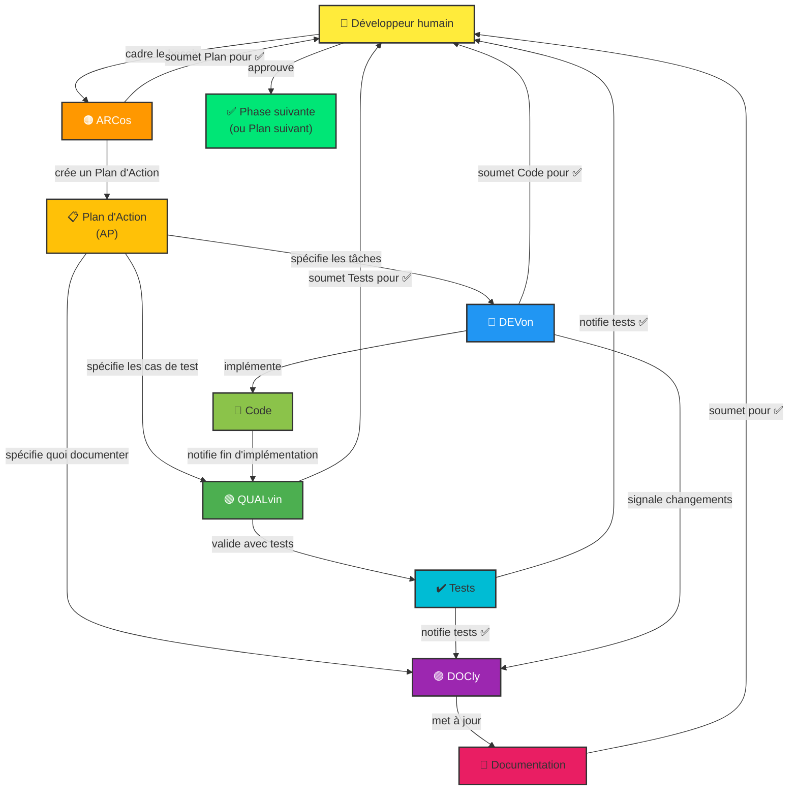

# Instructions Copilot — Template Générique

> **Utilisation** : Ce fichier est un template pour initialiser les instructions Copilot dans un nouveau projet. Remplacer les placeholders `[...]` par les valeurs spécifiques à votre projet.

## 👋 Bienvenue ! Agents Copilot et Relations

Le projet **[NOM_DU_PROJET]** utilise une **architecture multi-agents** orchestrée pour coordonner le développement, les tests et la documentation via des **Plans d'Action (AP)** structurés.

### 🤖 Les Agents et leurs Rôles

Quatre agents spécialisés travaillent ensemble, orchestrés par un **👤 Développeur humain** :

#### **🟠 ARCos** [v2.7]
- **Rôle :** Planificateur et orchestrateur technique
- **Responsabilités :**
  - Concevoir des solutions architecturales complètes
  - Créer et valider les Plans d'Action multi-phases
  - Décomposer les initiatives en tâches logiques
  - Orchestrer le travail entre Devon, Qalvin et Docly
  - Lire `.github/instructions/architect.instructions.md` au démarrage pour les spécificités du projet
  - Lire `docs/ARCHITECTURE.md` au démarrage pour comprendre le contexte architectural du projet
- **Quand l'utiliser :** "Conçois une architecture pour...", "Crée un plan pour...", "Découpe ça en tâches"
- **Livrable :** Plans d'Action détaillés avec phases, tâches et dépendances

#### **🔵 DEVon** [v2.3]
- **Rôle :** Implémentateur de code de production
- **Responsabilités :**
  - Traduire les exigences en code fonctionnel et testé
  - Respecter les patterns architecturaux et conventions du projet
  - Mettre à jour les dépendances et refactoriser le code
  - Implémenter les optimisations de performance
  - Lire `.github/instructions/dev.instructions.md` au démarrage pour les spécificités du projet
- **Quand l'utiliser :** "Implémente cette fonctionnalité", "Développe selon l'architecture", "Code cette fonction"
- **Livrable :** Code propre, compilant et compilant sans erreurs

#### **🟢 QUALvin** [v2.5]
- **Rôle :** Expert en assurance qualité et tests
- **Responsabilités :**
  - Écrire des tests unitaires complets (composants, services, modèles)
  - Assurer une couverture de test ≥80%
  - Tester les cas limites et les scénarios d'erreur
  - Valider que le code fonctionne correctement
  - Lire `.github/instructions/qa.instructions.md` au démarrage pour les spécificités du projet
- **Quand l'utiliser :** "Écris des tests pour ce composant", "Génère des tests unitaires", "Valide avec des tests"
- **Livrable :** Tests passants avec rapports de couverture

#### **🟣 DOCly** [v2.4]
- **Rôle :** Gardien de la documentation
- **Responsabilités :**
  - Mettre à jour README, `docs/` et guides
  - Maintenir `docs/ARCHITECTURE.md` à jour avec l'état réel du projet
  - Créer les ADRs dans `docs/adr/` sur délégation d'ARCos
  - Documenter les changements architecturaux
  - Mettre à jour les instructions Copilot quand les agents changent
  - Garder la documentation en sync avec le code
  - Lire `.github/instructions/doc.instructions.md` au démarrage pour les spécificités du projet
- **Quand l'utiliser :** "Mets à jour la documentation", "Garde les docs en sync avec ce code", "Ajoute ça au README"
- **Livrable :** Documentation à jour, claire et complète

---

### 🔄 Workflow Typique

1. **Cadrage (👤 Développeur humain)** → Définir le besoin et les critères d'acceptation
2. **Planification (🟠 ARC - Arcos)** → Créer un Plan d'Action avec phases et tâches
3. **Validation Humaine** → Approuver le plan avant de lancer
4. **Implémentation (🔵 DEV - Devon)** → Coder les tâches assignées
5. **Validation Humaine** → Approuver le code avant tests
6. **Tests (🟢 QUAL - Qalvin)** → Écrire et valider les tests
7. **Validation Humaine** → Approuver les tests avant doc
8. **Documentation (🟣 DOC - Docly)** → Mettre à jour la documentation
9. **Validation Humaine** → Approuver la documentation
10. **Phase Suivante** → Lancer la phase suivante du plan (étape 2)

> 💡 **Parallélisation** : Les étapes 4→6 (DEVon) et 6→8 (QUALvin + DOCly) peuvent être parallélisées avec `/fleet` quand les tâches sont indépendantes.

---

## 📋 Plans d'Action et Suivi

Chaque initiative majeure (modernisation, nouvelle feature, refactoring) est orchestrée via un **Plan d'Action (AP)** :

- **Fichier plan :** `.github/plans/<NO>_<nom>.plan.md`
- **Rapports de phase :** `.github/plans/<NO>_reports/PHASE_N_...md`
- **Index des plans :** `.github/plans/README.md`
- **Guide complet :** `.github/PLANS.md`

Les Plans d'Action coordonnent le travail multi-phases et garantissent une traçabilité complète via les rapports.

## 📐 Instructions Spécifiques Projet (`.github/instructions/`)

Chaque agent lit au démarrage son fichier d'instructions spécifique au projet :

| Fichier | Agent | Contenu |
|---|---|---|
| `architect.instructions.md` | 🟠 ARCos | Conventions archi, couches, protocole SQL handoff |
| `dev.instructions.md` | 🔵 DEVon | Stack technique, versions, conventions de code |
| `qa.instructions.md` | 🟢 QUALvin | Framework de test, commandes CI, cas à couvrir |
| `doc.instructions.md` | 🟣 DOCly | Fichiers /docs, conventions de documentation |

Ces fichiers contiennent les valeurs **spécifiques au projet** (versions réelles, chemins, noms de fichiers).  
Les agents génériques (`.github/agents/`) restent inchangés entre projets.

> Pour initialiser ces fichiers : utiliser le prompt `init-copilot-instructions`.  
> Pour les mettre à jour : utiliser le prompt `update-copilot-instructions`.

## 🛠️ Skills Partagés (`.github/skills/`)

Les skills sont des procédures réutilisables incluses automatiquement dans le contexte de tous les agents (`applyTo: **`) :

| Skill | Emplacement | Contenu |
|---|---|---|
| `plan-phase-execution` | `.github/skills/plan-phase-execution/SKILL.md` | Procédure standard d'exécution de phase AP (avant/pendant/après, formats de rapport) |
| `plan-creation` | `.github/skills/plan-creation/SKILL.md` | Procédure de création et d'orchestration d'un Plan d'Action (ARCos + agents orchestrateurs) |
| `fleet-guide` | `.github/skills/fleet-guide/SKILL.md` | Guide de parallélisation `/fleet` (quand utiliser, règle de décision) |
| `adr-writing` | `.github/skills/adr-writing/SKILL.md` | Rédaction d'un ADR après accord ARCos + humain : ARCos prépare le contenu, DOCly rédige le fichier |

Ces skills centralisent les procédures communes pour éviter la duplication entre agents.

---

## [📌 SECTION À COMPLÉTER : Présentation du Projet]

Remplacer cette section par une brève description de votre projet (1-2 paragraphes) :
- Domaine métier (ex: e-commerce, domotique, santé, etc.)
- Stack technologique principal (ex: React, Node.js, Python, etc.)
- Plateformes cibles (web, mobile, desktop, etc.)
- Langue de l'interface (si applicable)

### Exemple pour un projet React Native/Expo :
```
Application mobile React Native / Expo pour [DOMAINE MÉTIER].
Cible principalement [PLATEFORME] et le web.
L'interface utilisateur est en [LANGUE].
```

---

## [📌 SECTION À COMPLÉTER : Commandes]

Lister les commandes principales du projet (démarrage, tests, build, lint, etc.)

### Exemple pour un projet Node.js/npm :
```bash
npm start               # Démarrer le serveur de développement
npm test                # Lancer les tests
npm run lint            # ESLint
npm run build           # Build de production
```

---

## [📌 SECTION À COMPLÉTER : Architecture]

Décrire la structure du projet et les patterns architecturaux utilisés.

Éléments à couvrir :
- Structure des dossiers principaux (src/, app/, lib/, etc.)
- Couches principales (composants, services, modèles, contrôleurs, etc.)
- Patterns de gestion d'état (Context API, Redux, Zustand, etc.)
- Flux de données principal
- Paradigmes clés (réactif, impératif, etc.)

### Exemple pour un projet React :
```
src/
  components/         # Composants réutilisables
  pages/              # Pages/écrans
  services/           # Logique métier et API calls
  hooks/              # Custom hooks
  utils/              # Fonctions utilitaires
  styles/             # Styles partagés
  models/             # Modèles de données
```

---

## [📌 SECTION À COMPLÉTER : Conventions Clés]

Décrire les conventions de code et les patterns du projet. Couvrir :

### Nommage des fichiers
- Composants : `*.component.tsx` (ou autre convention)
- Services : `*.service.ts`
- Tests : `*.test.ts` (ou autre convention)
- Utilitaires : `*.utils.ts`

### TypeScript/JavaScript
- Mode strict activé ? (Oui/Non)
- Interfaces vs types ?
- Naming conventions (camelCase, PascalCase, CONSTANT_CASE)
- Classes vs fonctions ?

### Composants/Vues
- Hooks ou composants classe ?
- Gestion d'état (props, Context, Redux, etc.)
- Naming conventions pour les props et états
- Styles (CSS modules, styled-components, Tailwind, etc.)

### Services et Logique Métier
- Pattern d'appels API (fetch, axios, etc.)
- Gestion des erreurs HTTP
- Configuration et variables d'environnement

### Tests
- Framework (Jest, Vitest, Mocha, etc.)
- Pattern de setup et mocks
- Couverture minimale attendue (ex: ≥80%)

### Autres conventions
- Committing (conventional commits, etc.)
- Branching strategy (Git flow, trunk-based, etc.)
- Code review expectations

---

## [📌 SECTION À COMPLÉTER : État du Projet et Bonnes Pratiques]

Ajouter toute section pertinente pour les conventions spécifiques au projet :
- État de maintenance (stable, legacy, en evolution)
- Patterns d'erreur courants à éviter
- Dépendances clés et leurs usages
- Performance/optimisations importantes
- Sécurité (authentification, validation, etc.)

---

## 📊 Relations entre Agents (Diagramme Mermaid)



---

**🎯 Pour customiser ces instructions :** Remplacer tous les placeholders `[...]` par vos valeurs, puis utiliser le prompt `.github/prompts/update-copilot-instructions.prompt.md` pour auditer et enrichir ce fichier depuis le code source.


